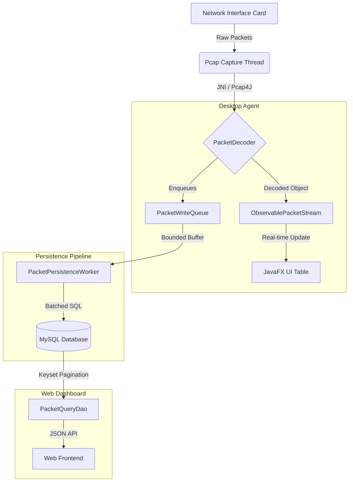
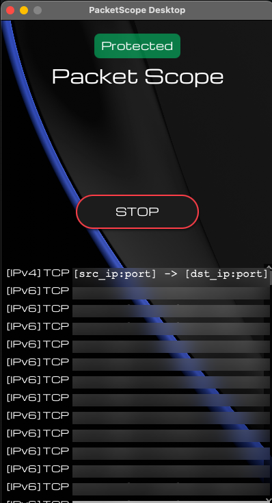
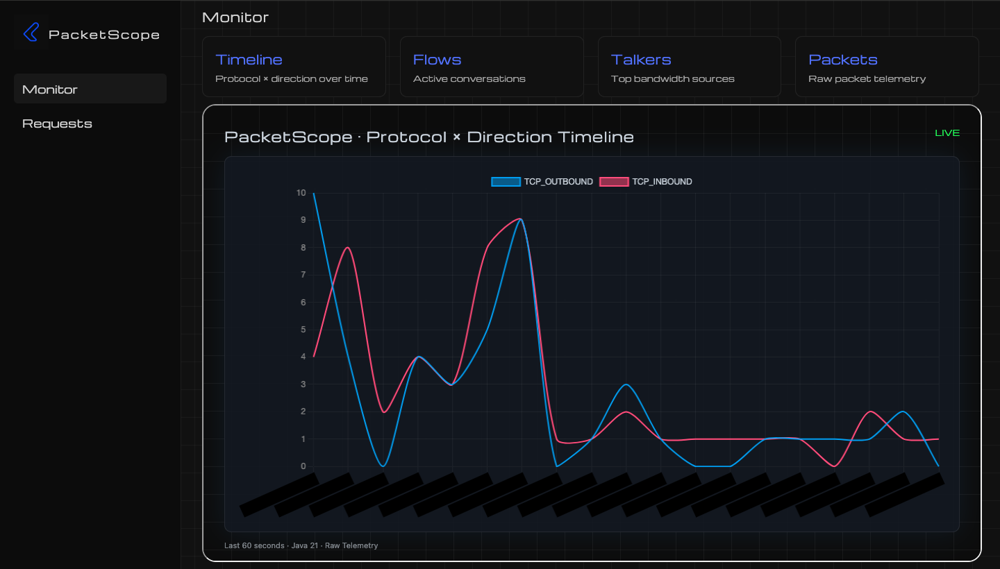
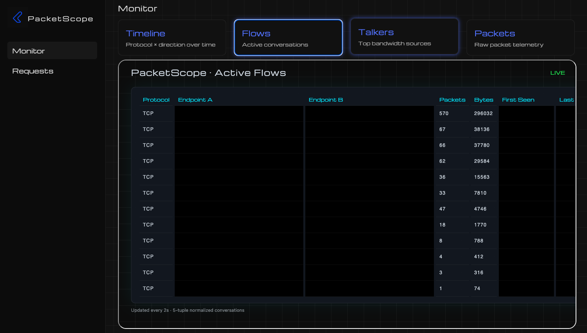
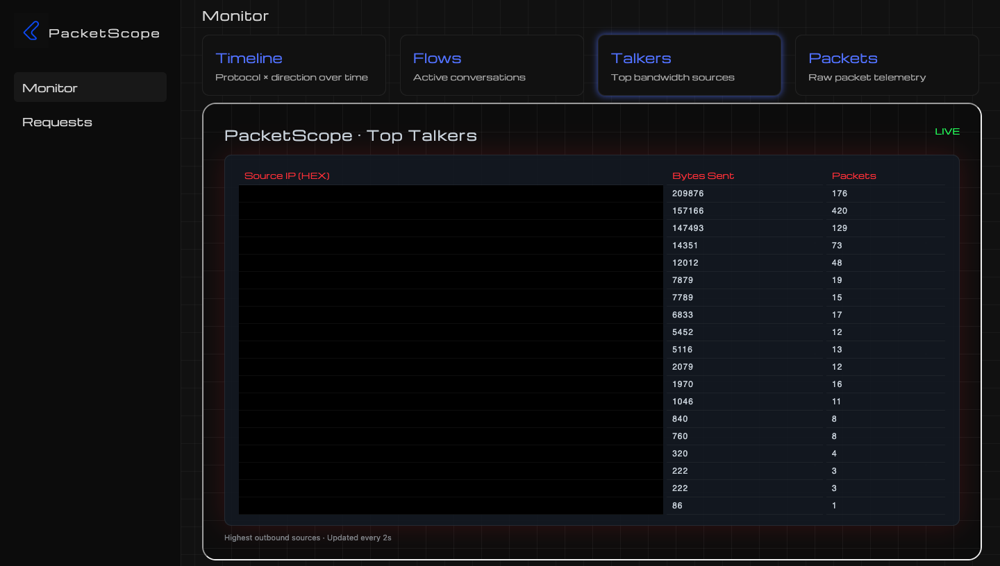
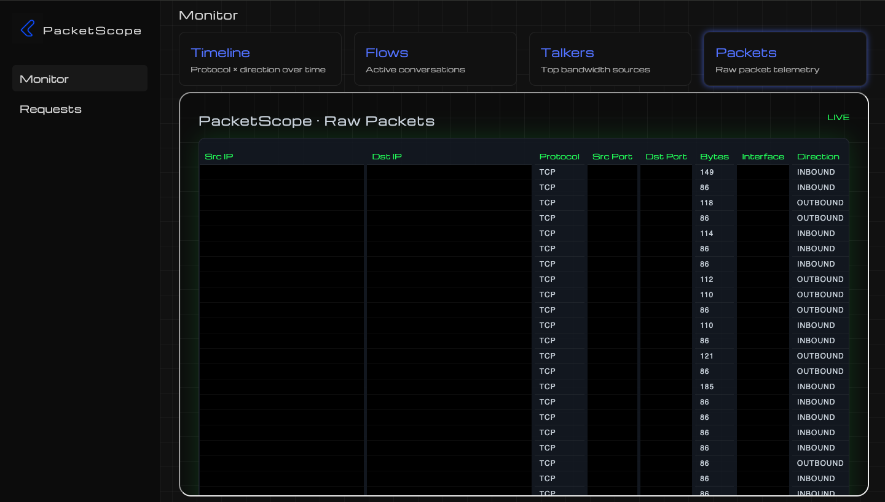
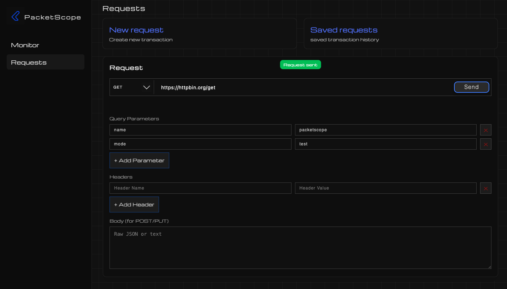

# PacketScope

PacketScope is a full-stack local network telemetry and inspection platform that combines **real-time packet capture**, **persistent flow analytics**, and a **web-based monitoring dashboard**.

It is designed for developers and engineers who want deep visibility into live traffic, protocol behavior, and HTTP transactions without relying on heavyweight external observability platforms.

PacketScope operates entirely locally and favors explicit control over abstractions.

**The system consists of:**

- A JavaFX desktop agent for packet capture and ingestion
- A high-performance persistence layer (batched SQL writes)
- A minimal Java HTTP server exposing analytics endpoints
- A modern web dashboard for visualization and request inspection

---

## High-Level Architecture

PacketScope consists of two primary components:

### Desktop Capture Agent

Responsible for:

- Live packet capture via libpcap / Npcap (Pcap4J)
- Protocol decoding (IPv4 / IPv6)
- TCP / UDP transport parsing
- Direction classification (Inbound / Outbound)
- Buffered UI streaming
- Batched database persistence

Pipeline:

```

Network Interface
↓
Pcap Capture Thread
↓
PacketDecoder
↓
ObservablePacketStream (UI)
↓
PacketWriteQueue
↓
PacketPersistenceWorker (batched SQL writes)

```

Key characteristics:

- Dedicated capture thread
- UI-safe observable packet stream
- Bounded persistence queue with drop tracking
- Transactional batch inserts
- Clean pcap lifecycle ownership

---

### Web Analytics Server

A lightweight Java HTTP server exposing:

- Timeline analytics (protocol × direction)
- Active flows
- Top talkers
- Raw packet telemetry
- HTTP transaction inspection
- Saved request replay

Endpoints are backed by optimized SQL queries using:

- Keyset pagination (no OFFSET scans)
- Flow normalization
- Time-bucket aggregation
- JSON-based transaction logging
- Static frontend (HTML / CSS / JS)

No frameworks. No ORMs. No middleware.

---

### System Architecture and Data Flow



---

## Features

### Packet Telemetry

- TCP capture
- IPv4 / IPv6 support
- Source / destination ports
- Interface awareness
- Direction classification via local IP resolution

### Persistence

- Batched inserts (200 packets / transaction)
- Manual commit / rollback
- Cursor-based reads
- Flow aggregation
- Top talker computation

### Dashboard

- Protocol × direction timeline (Chart.js)
- Active flows
- Top talkers
- Raw packet list
- HTTP request composer
- Transaction history
- Replay support

### Request Inspection

- Custom HTTP requests
- Header/body editing
- Response capture
- Persistent transaction logs
- Replayable saved requests

---

## Technology Stack

### Backend / Desktop

- Java 21
- JavaFX
- Pcap4J
- JDBC
- Embedded Java HTTP server
- MySQL-compatible database

### Frontend

- Vanilla HTML / CSS / JavaScript
- Chart.js (timeline visualization)

No frontend frameworks.

---

## Project Structure (High Level)

```
packetscope/
│
├── packetscope-desktop/
│     ├─ controller/
│     ├─ model/
│     ├─ persistence/
│     ├─ repository/
│     ├─ service/
│     ├─ view/
│     └─ resources/
│         ├─ fxml/
│         ├─ styles/
│         └─ images/
│
│
└── packetscope-web/
      ├─ http/
      ├─ controller/
      ├─ db/
      ├─ model/
      ├─ service/
      ├─ util/
      └─ resources/
          ├─ static/
          └─ templates/

```

---

## Screenshots

> screenshots:

```markdown
### Desktop Capture Agent



### Protocol × Direction Timeline



### Active Flows



### Top Talkers



### Raw Packets



### Request Inspector


```

---

## Database

PacketScope expects the following primary tables:

### packets

Stores:

- captured_at
- ip_version
- protocol
- source_ip
- destination_ip
- source_port
- destination_port
- packet_size
- interface_name
- direction

### transaction_logs

Stores:

- HTTP method
- URL
- request headers/body (JSON)
- response status
- response headers/body
- timestamps

---

## Configuration

Desktop uses environment-based config:

```
config.properties
config-prod.properties
```

Selected via:

```bash
-Denv=prod
```

Example:

```
db.url=jdbc:mysql://localhost:3306/packetscope
db.user=root
db.password=yourpassword
```

Web server uses:

```
application.properties
application-prod.properties
```

---

## Running

### Desktop Agent

Requires:

- Npcap / libpcap
- Active network interface
- Database access

Start:

```bash
java -jar packetscope-desktop.jar
```

---

### Web Server

Start:

```bash
java -jar packetscope-web.jar
```

Dashboard:

```
http://localhost:8080
```

---

## Design Philosophy

PacketScope intentionally favors:

- Explicit threads over frameworks
- SQL over ORMs
- Native packet access
- Simple HTTP servers
- Local-first operation

This is not a cloud observability platform.

It is a developer-side inspection engine.

---

## Limitations

- TCP only (currently, can be configured to use other protocols)
- Single-user context
- Local deployment
- MySQL-oriented SQL
- No authentication layer (by design)

---

## Prerequisites & Installation

### 1. Packet Capture Drivers

Because PacketScope accesses the Network Link Layer, you must have the appropriate drivers installed to allow the JVM to interface with your hardware:

- **Windows**: Install **[Npcap](https://npcap.com/)**.
  - _Crucial:_ During installation, ensure you check the box: **"Install Npcap in WinPcap API-compatible Mode"**.
- **macOS**: Uses the native **libpcap** (usually pre-installed).
- **Linux**: Install **libpcap** (e.g., `sudo apt-get install libpcap-dev`).

### 2. Permissions (The "Raw Socket" Problem)

Capturing live packets requires elevated privileges. To avoid the security risk of running the entire application as `root` or `Administrator`, use the following configurations:

- **Linux**: Grant the Java binary the specific capability to capture packets without sudo:
  ```bash
  sudo setcap cap_net_raw,cap_net_admin=eip /path/to/your/java_home/bin/java
  ```
- **Windows**: Ensure the user running the app has administrative privileges, or that Npcap was installed with the "Restrict Npcap driver access to Administrators only" option **unchecked**.

### 3. Database Setup

PacketScope is optimized for **MySQL/MariaDB**.

1.  Create a database named `packetscope`.
2.  Execute the schema scripts located in: `/packetscope/resources/schema.sql`.
3.  Configure your credentials in `config.properties` (Desktop) and `application.properties` (Web).

### 4. Build & Run

The project uses Maven for dependency management and build automation.

```bash
# Build the entire project
mvn clean install

# Run the Desktop Agent
java -jar packetscope-desktop/target/packetscope-desktop.jar

# Run the Web Dashboard
java -jar packetscope-web/target/packetscope-web.jar

```

---

## License

MIT
